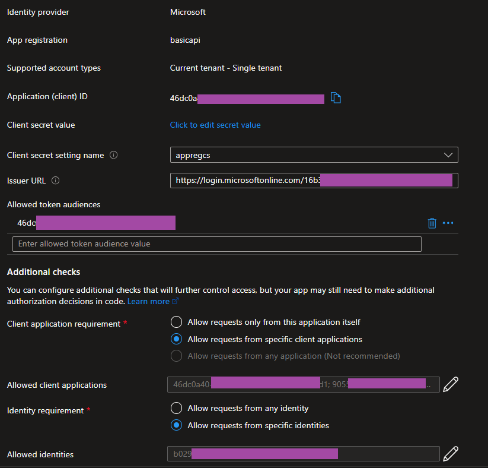
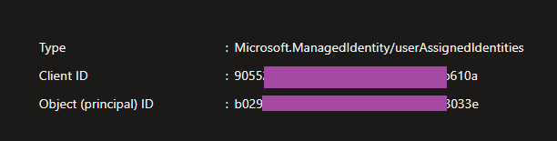
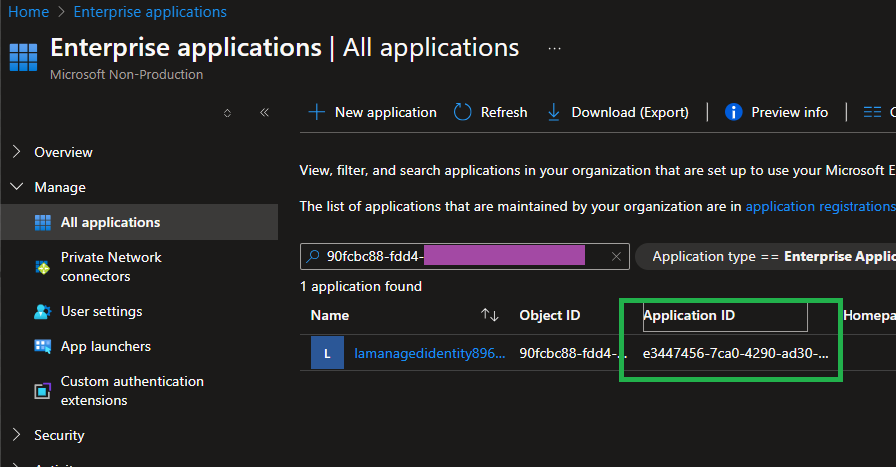

# easy-auth-labs
In Azure PaaS services, like [App Service](https://learn.microsoft.com/en-us/azure/app-service/overview-authentication-authorization), [Azure Container Apps](https://learn.microsoft.com/en-us/azure/container-apps/authentication), [Azure Functions](https://learn.microsoft.com/en-us/azure/azure-functions/security-concepts#enable-app-service-authenticationauthorization), and [Logic Apps](https://learn.microsoft.com/en-us/azure/logic-apps/logic-apps-securing-a-logic-app?tabs=azure-portal#enable-oauth), there is an option to add Authentication so you do not need to code it into your application. This is often times referred to as "Easy Auth".

Enabling Easy Auth on these services, will put a middleware layer to validate the HTTP authorization header bearer tokens against a specific Entra ID (or other OAuth provider) App Registration. 

Easy Auth is really simple to setup however it can be confusing as to how to get the correct token to call the auth enabled services. That is where this repo comes in to hopefully help clarify.

## Easy Auth Setup

## Scenarios

### Managed Identity -> Container Apps

Image from the Azure Container Apps Authorization page:


Where the **Application (client) ID** is the App registration client id.

**Issuer URL** is `https://login.microsoftonline.com/<TENANT-ID>/v2.0`

For **Allowed token audiences**, you will list out the Application (client) ID or it could be `api://<client-id>` depending on how you are getting the token. Check [jwt.ms](https://jwt.ms) and look for the `aud` value

Under **Aditional Checks**, if you want to allow a managed identity to connect, then select **Allow requests from specific client applications** and list the Application (client) ID and also the client id of the managed identity. 

You can find the client id of the user assigned managed identity by going to the Managed Identity overview page like below.



If you are using a System Assigned identity, then navigate to "Enterprise applications" and search the list on the object (principal) ID shown on the System assigned identity tab. Then use the value in the "Application ID" column



Below is a code snippet on how to use the Managed Identity to call the Easy Auth enabled endpoint.

```
import os
import requests
from azure.identity import ManagedIdentityCredential

managed_identity_client_id = os.environ.get("MANAGED_IDENTITY_CLIENT_ID")
api_uri = os.environ.get("API_URI")
test_endpoint = os.environ.get("TEST_ENDPOINT")

credential = ManagedIdentityCredential(client_id=managed_identity_client_id)
token = credential.get_token(f"{api_uri}/.default")
headers = {
    "Authorization": f"Bearer {token.token}"
}
resp = requests.get(test_endpoint, headers=headers)
print(resp.text)
```


### Logic App (Consumption) -> Function App


### Service Principal -> Logic App (Standard) 
```
token_request_data = {
   'client_id': '<CLIENT_ID>',
   'scope': ['api://<APPREG_CLIENTID>/.default'],
   'client_secret': '',
   'grant_type': 'client_credentials'
}

token_resp = requests.post("https://login.microsoftonline.com/<TENANTID>/oauth2/v2.0/token", data=token_request_data )
```


## Bonus!

### APIM Validate JWT